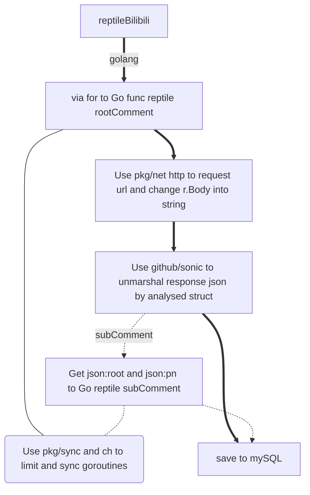

Bonus

1.200左右( A connection attempt failed because the connected party did not properly respond after a period of time)(200线程限制下只能跑到1w3的评论，然后请求被拦截了)

2.

3.code:请求状态码 成功为0 失败有-400 -412

message:状态信息 成功为0 失败有请求错误、请求被拦截

ttl:数据包存活时间（百度的）

data:数据{

​	cursor:光标(意思是鼠标移动相关？){

​		is_begin:是否从第一个评论开始(?)

​		prev:

​		next:

​		is_end:是否到最后一个评论(?)

​		mode:2最新 3最热

​		all_count:总评论数

​		name:热门、最新

​		session_id:sessionid 是一个会话的 key，一直保存在服务器中，未失效则下次访问不需要再次登录

​	}

​	replies:保存评论与回复[]{

​		rpid:评论id，主评论的可用于访问子评论

​		oid:视频bv号

​		type:我不知道

​		root/parent:子评论特有，指向主评论id，主评论为0

​		dialog:子评论特有，主为0

​		count:主特有，回复数(包含被删的?)，子为0

​		rcount:主评论特有,表示回复数,子为0

​		state:不知道，可能表示是否被删

​		attr:属性，不知道意义

​		ctime:时间戳

​		like:点赞数

​		menber{

​			mid:uid

​			uname:名字

​			level_info:等级相关

​			pendant:挂件

​			cardbg:动态卡片装扮

​			}

​		content{

​			message:正文

​			emote:表情相关图片链接

​		jump_url:搜索栏里的自动推荐(?)

​			}

​		}

}

