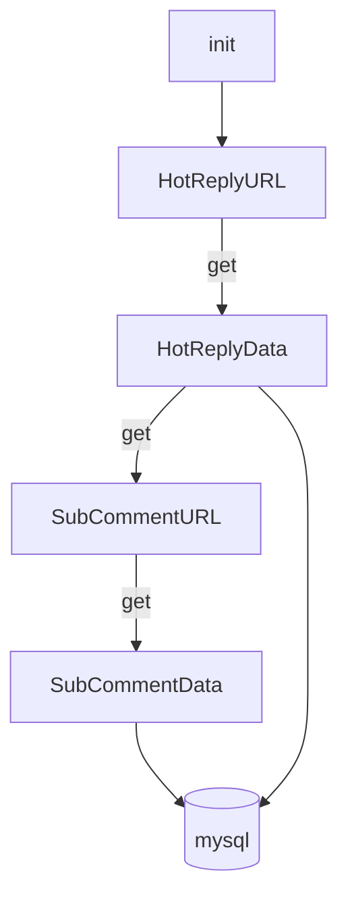

## one
上锁之前通过[程序](bonus/findThresholdValue.go)找出的最大值为196。

## two

```mermaid
graph TD
    init[init]
    mysql[(mysql)]
    init --> HotReplyURL
    HotReplyURL -->|get|HotReplyData
    HotReplyData -->|get|SubCommentURL
    SubCommentURL -->|get|SubCommentData
    SubCommentData --> mysql
    HotReplyData --> mysql
    
```
