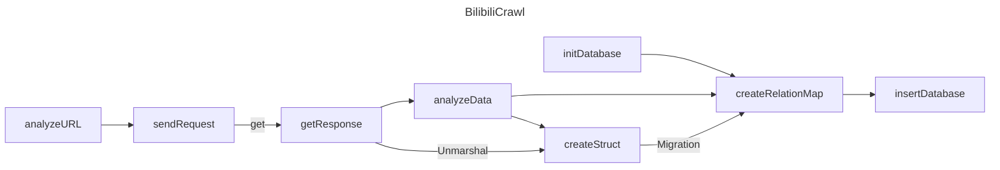

## Bonus1:
- 一秒钟发送了几千个请求都没被ban，懵逼了，找不到阈值T.T

## Bonus2:


## Bonus3:
```
type BilibiliComment struct {
	Data Data `json:"data"` //评论数据
}
type Data struct {
	MainReply []MainReply `json:"replies"` //主评论
}
type MainReply struct {
	Content Content `json:"content"` //主评论内容
	Member  Member  `json:"member"`  //发表主评论的用户
	Replies []Reply `json:"replies"` //回复主评论的次评论
}
type Reply struct {
	Content Content `json:"content"` //评论文本
	Member  Member  `json:"member"`  //发表次评论的用户
}
type Member struct {
	Uname string `json:"uname"` //用户ID
}
type Content struct {
	Message string `json:"message"` //评论的内容
}
```