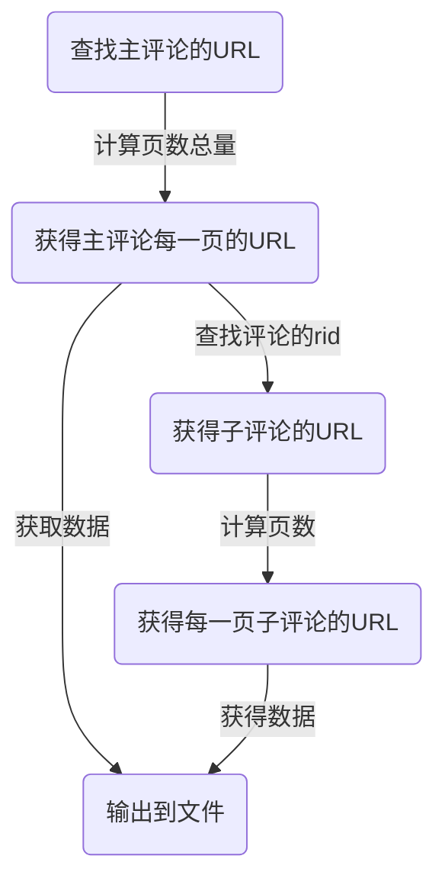

#### 阈值大概为180线程以下

### 流程图

```mermaid
flowchart TD
    A(查找主评论的URL) --计算页数总量--> B(获得主评论每一页的URL)
    B --获取数据--> C(输出到文件)
    B --查找评论的rid--> D(获得子评论的URL)
    D --计算页数--> E(获得每一页子评论的URL)
    E --获得数据--> C
    
```

    

    
            