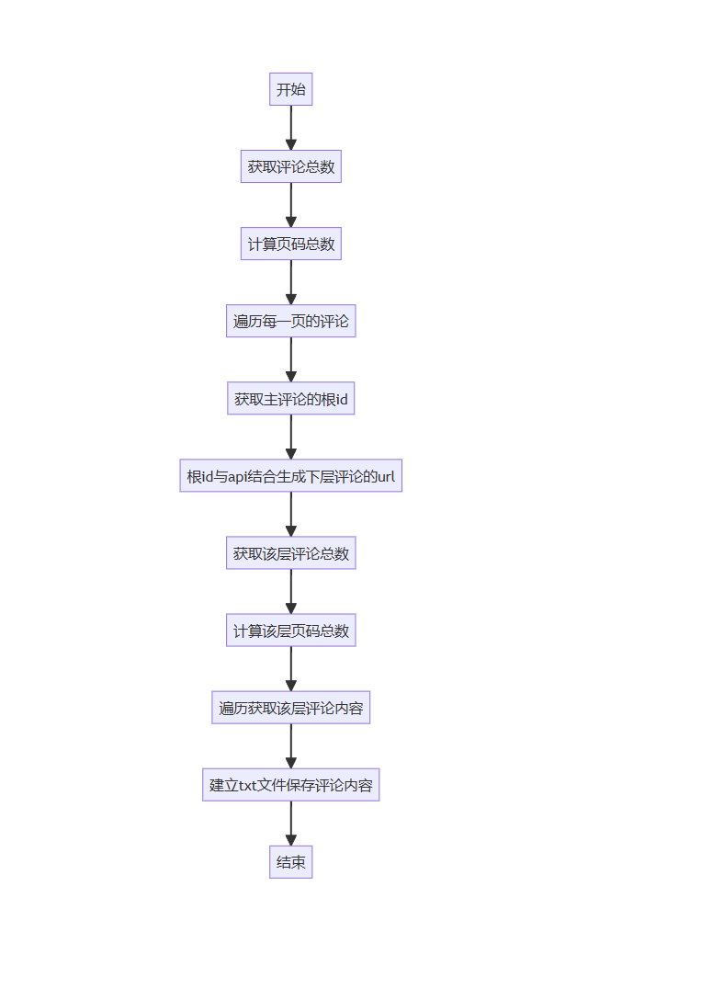

### 1.Bilibili爬虫检测阈值（请求频率高于这个阈值将会被ban。也可以是你被封时的请求频率）

### 2.获取评论总数
        计算页码总数
        遍历每一页的评论,获取主评论的根id
        根id与api结合生成下层评论的url
        获取该层评论总数
        计算该层页码总数
        遍历获取该层评论内容
        建立txt文件保存评论内容
### 

## 3.给出接口返回的json中每个参数所代表的意义
### 评论的api: https://github.com/SocialSisterYi/bilibili-API-collect/blob/master/docs/comment/list.md