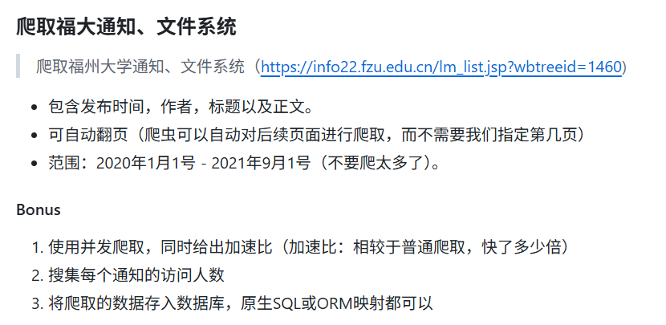

## 任务截图



## 编译&运行

开发环境：go1.25.1 windows/amd64, MySQL 8.0.43

```bash
go mod tidy
go build crawl_fzu
./crawl_fzu.exe
```


## 发布日志
- 1.0 - 2025-10-10
  - √ 包含发布时间，作者，标题以及正文。
  - √ 可自动翻页（爬虫可以自动对后续页面进行爬取，而不需要我们指定第几页）
  - √ 范围：2020年1月1号 - 2021年9月1号（不要爬太多了）。
  - √ 并发爬取。
  - √ 存入数据库。


## 技术细节

- 爬取函数两个，并行和普通的。

  ```go
  // 并行爬取
  // maxPageCount: 爬取的最大页码。传入0使用默认值。在写这篇文档时最大页码大约在1090左右。
  // maxRoutineCount: 爬取的最大并行数。传入0使用默认值100。可按需求调节。
  func crawlFzuAsync(maxPageCount int, maxRoutineCount int)
  
  // 普通爬取为无Async的crawlFzu版本，参数返回值一致。
  ```

- 并行爬取的加速比约为：1:40
  ```
  Crawl finished in 1m1.0730687s.   // 并行
  Crawl finished in 40m24.2284831s. // 普通
  ```

- 文章结构体

  ```go
  /* 文章数据 */
  type article struct {
  	Date   string // 日期
  	Author string // 作者
  	Title  string // 标题
  	Body   string // 正文
  	Clicks int    // 点击数
  }
  ```

- 数据库中对应的`Body`字段的数据类型选择问题：

  经统计，正文最大长度为71352，超过`text`的 65535 byte，因此使选用`mediumtext`（2^24-1byte）

- 运行程序将在 mysql 自动创建数据库`fzu`，内含表`notice`。文章数据将在程序运行成功后保存在该表中。