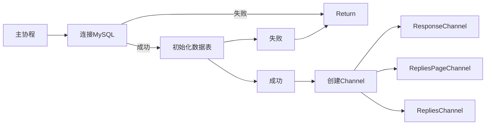

```mermaid
flowchart LR;

多协程--当Channel被创建时-->协程池

协程池-->协程1[主协程]
协程1[主协程]--DataCatchOver==true-->主协程结束-->关闭MySQL
协程1[主协程]--DataCatchOver==false-->主协程继续


协程池-->协程2[单协程]-->评论区页码Next++--is_end==false-->评论区页码Next++
评论区页码Next++--组装Request,随机间隔发送GET请求-->B站服务器
B站服务器--返回Response-->协程2[单协程]--Response-->ResponseChannel
评论区页码Next++--is_end==true-->协程2停止,PageReachEnd=true
ResponseChannel--传输Response-->协程通过Response获取页面json数据


协程池-->协程3[单协程]--DataCatchOver==false-->建立协程池1,但个数受到限制-->协程通过Response获取页面json数据--json文件-->RepliesPageChannel
协程3[单协程]--DataCatchOver==true-->协程3停止

协程池-->协程4[单协程]--DataCatchOver==false-->建立协程池2,但个数受到限制-->处理json文件,并整理成需要的数据结构
RepliesPageChannel--传输json文件-->处理json文件,并整理成需要的数据结构--传输Reply数据结构体-->RepliesChannel
协程4[单协程]--DataCatchOver==true-->协程4停止

协程池-->协程5[单协程]--DataCatchOver==false-->建立协程池3,但个数受到限制-->将Reply数据插入MySQL对应数据表中
RepliesChannel--Reply数据结构体-->将Reply数据插入MySQL对应数据表中
协程5[单协程]--DataCatchOver==true-->协程5停止

协程池-->协程6[单协程]-->DataCatchOver==false,间隔性执行一次操作-->若各Channel为空,且翻页到最后一页,关闭全部Channel
若各Channel为空,且翻页到最后一页,关闭全部Channel--关闭-->ResponseChannel
若各Channel为空,且翻页到最后一页,关闭全部Channel--关闭-->RepliesPageChannel
若各Channel为空,且翻页到最后一页,关闭全部Channel--关闭-->RepliesChannel
协程6[单协程]-->DataCatchOver==true-->协程6停止
```