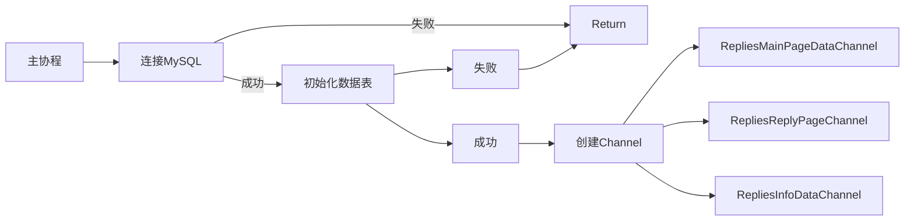
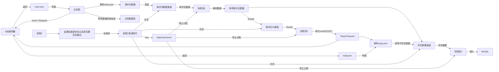

```mermaid
flowchart LR;
    主协程-->连接MySQL
    连接MySQL--失败-->Return
    连接MySQL--成功-->初始化数据表
    初始化数据表-->失败-->Return
    初始化数据表-->成功-->创建Channel
    创建Channel-->RepliesMainPageDataChannel
    创建Channel-->RepliesReplyPageChannel
    创建Channel-->RepliesInfoDataChannel
```

```mermaid
flowchart LR;

B站服务器--返回-->main.json--传输-->主协程
主协程--'next++'Request-->B站服务器
主协程--解析main.json-->母评论数据--发送-->母评论数据通道
主协程--等待数据抓取结束-->关闭数据库

母评论数据通道--母评论数据-->协程池2--解析数据-->获得母评论数据-->评论数据通道
获得母评论数据--RootId-->根评论ID通道

根评论ID通道--RootId-->协程池3--转化rootid为'GET'-->'Reply'Request-->B站服务器
'Reply'Request-->解析reply.json
B站服务器--返回-->reply.json--传输-->解析reply.json
解析reply.json--获得子评论数据-->评论数据通道

评论数据通道--评论数据-->协程池4--插入-->MySQL

协程5-->监视各通道状态以及是否翻页到最后--全满足-->协程5发送指令
协程5发送指令--关闭-->母评论数据通道
协程5发送指令--关闭-->根评论ID通道
协程5发送指令--关闭-->评论数据通道
协程5发送指令--true-->DataCatchOver
DataCatchOver--停止分配-->协程池2
DataCatchOver--停止分配-->协程池3
DataCatchOver--停止分配-->协程池4
```