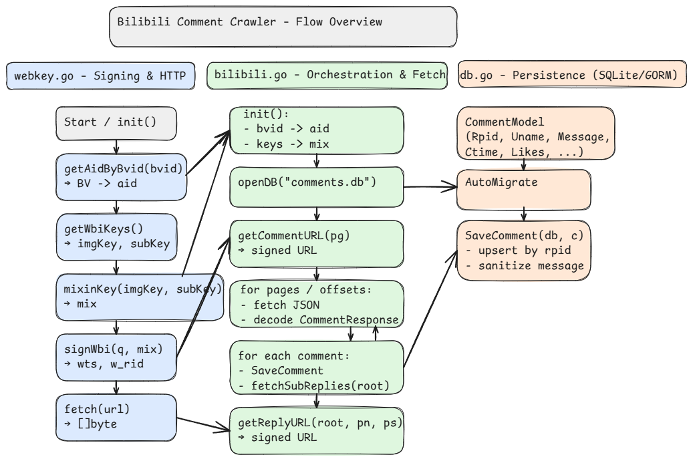

# Bonus1 Bilibili爬虫检测阈值
封禁前一秒爬了76条评论

# Bonus2 Excalidraw 流程图

# Bonus3 json中每个参数所代表的意义

下面把你这份抓取脚本里涉及到的「评论接口请求参数」和「评论 JSON 响应体」逐项说明（以代码中的结构体/构造 URL 为准）：

### 一、请求参数（主评列表 /x/v2/reply/wbi/main）

* **oid**：对象 ID，这里传的是视频 **aid**（脚本里先由 bvid→aid）。
* **type**：对象类型，这里固定写 `"1"`（与视频类型对应）。
* **mode**：模式/排序方式，这里脚本固定 `"3"`（具体语义未在代码内定义）。
* **pagination\_str**：分页偏移量字符串，形如 `{"offset":"<上一页返回的next_offset>"}`，首轮为空串。
* **plat**：平台标识，这里固定 `"1"`。
* **wts**：WBI 的时间戳参数，由 `signWbi` 计算。
* **w\_rid**：WBI 的签名参数，由 `signWbi` 基于查询串和 mixinKey 计算。
  （以上参数的拼接逻辑见 `getCommentURL`。）

### 二、请求参数（子评列表 /x/v2/reply/reply）

* **oid**：同上，视频 **aid**。
* **type**：同上，固定 `"1"`。
* **root**：主评的 **rpid**（要拉取其下的子评）。
* **pn**：子评页码，从 1 递增。
* **ps**：每页子评数量，脚本里固定 `20`。
* **plat**：平台标识，固定 `"1"`。
* **wts / w\_rid**：同上，由 `signWbi` 生成。
  （见 `getReplyURL` 的参数拼接。）

### 三、主评接口响应体（/x/v2/reply/wbi/main）

顶层：

* **code**：状态码（0 通常表示成功）。
* **data**：数据主体。

`data` 内部：

* **replies**：主评数组（类型见下文 `Comment`）。
* **cursor.pagination\_reply.next\_offset**：下一页偏移量。若为空字符串 `""` 表示没有下一页。
  （结构定义见 `CommentResponse`。）

### 四、子评接口响应体（/x/v2/reply/reply）

顶层：

* **code**：状态码。
* **data**：数据主体。

`data` 内部：

* **replies**：子评数组（同样使用 `Comment` 结构）。
* **page**：分页信息对象

  * **count**：子评总数。
  * **num**：当前页码。
  * **size**：每页条数（脚本请求为 20）。
    （解析逻辑与字段出现在 `fetchSubReplies` 中。）

### 五、评论对象结构 `Comment`

* **rpid**：评论 ID。
* **ctime**：评论创建时间（Unix 时间戳，单位秒）。
* **like**：点赞数。
* **member**：评论者信息对象

  * **uname**：用户昵称。
* **content**：评论内容对象

  * **message**：评论文本内容。
    （以上字段在 `Comment` / `Member` / `Content` 结构体中定义。）

