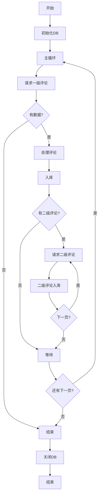

### 给出Bilibili爬虫检测阈值（请求频率高于这个阈值将会被ban。也可以是你被封时的请求频率）
- 每秒两次请求可以稳定运行，测试了3以上的都不行

### 给出爬取的流程图，使用mermaid或者excalidraw

```mermaid
graph TD
    A[开始] --> B[初始化DB]
    B --> C[主循环]
    
    C --> D[请求一级评论]
    D --> E{有数据?}
    E -->|否| F[结束]
    E -->|是| G[处理评论]
    
    G --> H[入库]
    H --> I{有二级评论?}
    I -->|是| J[请求二级评论]
    I -->|否| K[等待]
    
    J --> L[二级评论入库]
    L --> M{下一页?}
    M -->|是| J
    M -->|否| K
    
    K --> N{还有下一页?}
    N -->|是| C
    N -->|否| F
    
    F --> O[关闭DB]
    O --> P[结束]
```
### 给出接口返回的json中每个参数所代表的意义
- 在代码的注释里
  