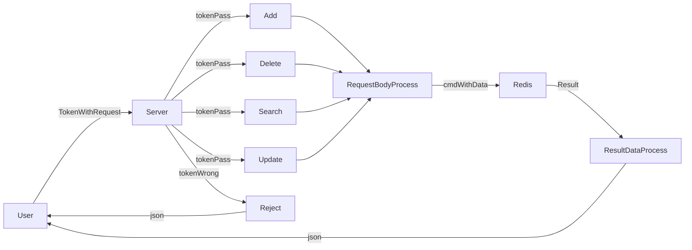
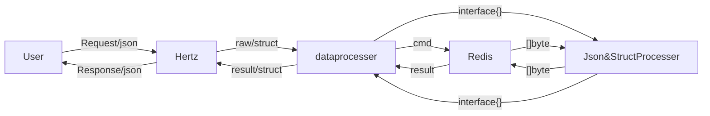

### Work3

本文件夹内有两个版本,分别是mysql版与redis版

mysql版本修改数据比较直接,输入指令即可(关系数据库)

redis版本修改数据可能会改变原来的index,因为我并没有用中间插入的方法,只采用RPush(),即为从链表尾部插入,同时整体交互结构大体如下(非关系数据库)

redis版本中，约等于三层架构:
- 1.Hertz用于面向用户的消息收发
- 2.dataprocesser用于处理Herz传入的struct,并转换为相应的cmd与data(interface{});同时,dataprocesser也用于处理myredis传出的interface{},并转化为相应的struct
- 3.myredis处理interface{}与json([]byte)之间的转化,存储的数据均为string格式(并没有使用rejson module)

结构大致如下

