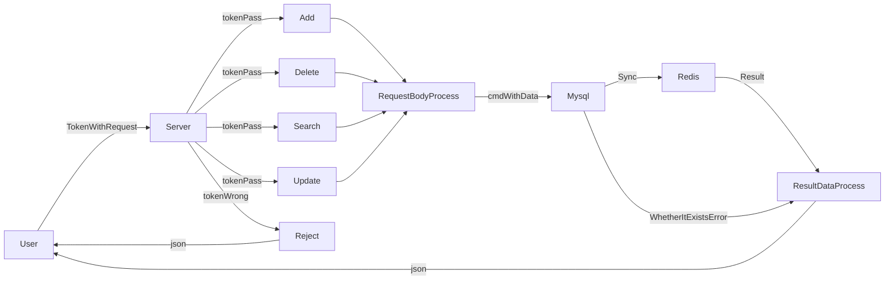
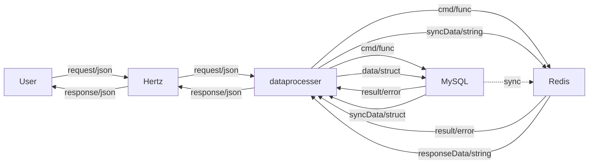

### Work3

本文件夹内仅有一个版本,以redis作为数据库前端(Cache),Mysql作为数据库后端(Storage).

Redis账号数据：每启动一次服务便全部同步一次,仅在registerApi内同步添加,TTL No Limit

Redis备忘录数据：在“查找、添加、删除、更新”操作时同步Mysql对应Owner数据,且具有生命周期

- 查找操作：若对应Cache为空,则同步Storage数据(若Redis内不为空则直接添加到Redis,无需同步)
- 添加操作：首先更新Storage数据,再同步Storage数据
- 删除操作：首先更新Storage数据,再同步Storage数据
- 更新操作：首先更新Storage数据,再同步Storage数据

- 以上四者均会更新TTL

可见，操作为先更新Storage，再更新Cache

本版本约为三层架构:
- 1.Hertz用于面向用户的消息收发
- 2.dataprocesser(部分位于HandleFunc内)用于处理Herz传入的struct,并转换为相应的func(cmd)与interface{}(data);dataprocesser用于处理redis传出的string(json),并转化为相应的struct(data);dataprocesser用于处理mysql传出的struct(data),并转化为相应的string(json)
- 3.redis主要获取或提供经过dataprocesser处理后的json(data),仅执行同步的指令
- 4.mysql接收dataprocesser处理后的func(cmd)以及struct(data)

结构大致如下

